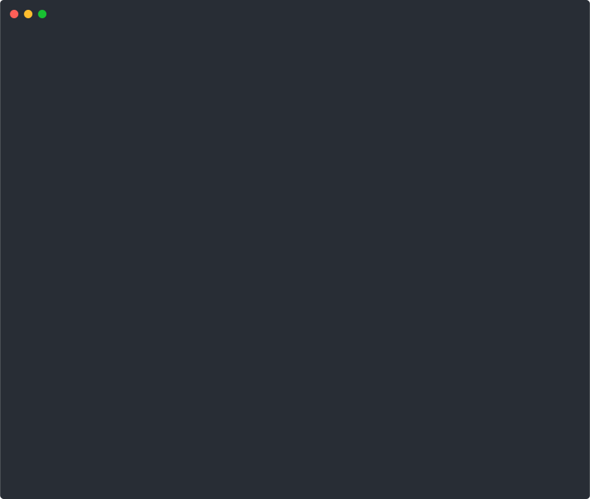

# Claude Code Ops Starter

[](LICENSE)
[](https://www.gnu.org/software/bash/)
[](https://docs.anthropic.com/en/docs/claude-code)

**Spend less time babysitting your AI.** 4 production-tested hooks that let Claude Code run with less supervision — catching errors, managing context, and making decisions without asking you constantly.

<a href="https://github.com/yurukusa/claude-code-ops-starter/blob/main/assets/risk-score-fix-demo.svg"></a>

```bash
# Try it now (read-only scan, nothing installed)
curl -sL https://gist.githubusercontent.com/yurukusa/10c76edee0072e2f08500dd43da30bc3/raw/risk-score.sh | bash

# Auto-fix with free hooks (non-destructive, existing files kept)
curl -sL https://gist.githubusercontent.com/yurukusa/10c76edee0072e2f08500dd43da30bc3/raw/risk-score.sh | bash -s -- --fix
```

Extracted from 140+ hours of real autonomous operation that shipped a [15,000-line game](https://yurukusa.itch.io/azure-flame) without the human writing code themselves.

### Before vs After

| Without hooks | With hooks |
|--------------|-----------|
| Claude asks "should I continue?" every 5 min | Claude decides and logs uncertainty |
| Syntax errors found 50 tool calls later | Errors caught immediately after every edit |
| Session runs out of context without warning | Staged warnings at 80/120/150 tool calls |
| `rm -rf` executes with no warning | Destructive commands flagged before execution |

## What's Included

| File | What it does |
|------|-------------|
| `hooks/context-monitor.sh` | Tracks context window usage with staged warnings (soft/hard/critical) |
| `hooks/no-ask-human.sh` | Blocks "should I continue?" questions — forces autonomous decisions |
| `hooks/syntax-check.sh` | Auto-runs syntax verification after every file edit (Python, Shell, JSON) |
| `hooks/decision-warn.sh` | Flags destructive commands (`rm -rf`, `git reset --hard`) before execution |
| `templates/CLAUDE.md` | Baseline instructions for autonomous operation |
| `tools/claude-md-generator.sh` | Interactive CLAUDE.md generator — answer 8 questions, get a tailored config |
| `tools/risk-score.sh` | Check your autonomous operations safety in 10 seconds — scores 10 items, links to fixes |
| `tools/cc-solo-watchdog.sh` | Idle detector — monitors your Claude pane and sends a nudge when it goes quiet |
| `install.sh` | One-command setup |

## Quick Start

```bash
git clone https://github.com/yurukusa/claude-code-ops-starter.git
cd claude-code-ops-starter
bash install.sh
```

Then add the hook configuration to your `~/.claude/settings.json` (the installer prints the exact JSON to copy-paste).

## How the Hooks Work

### Context Monitor
Counts tool calls as a proxy for context window usage. Warns you at 3 thresholds:
- **Soft (80 calls)**: "Consider deferring large tasks"
- **Hard (120 calls)**: "Wrap up and prepare to hand off"
- **Critical (150 calls)**: Auto-generates a checkpoint file for session handoff

### No-Ask-Human
Blocks **all** `AskUserQuestion` tool calls during unattended sessions. Instead of stopping to ask "which approach should I use?", the AI:
1. Decides on its own
2. Logs uncertainty to `~/pending_for_human.md`
3. Moves to the next task

To temporarily re-enable questions: `export CC_ALLOW_QUESTIONS=1`

### Syntax Check
Runs after every `Edit` or `Write` tool call:
- Python: `python -m py_compile`
- Shell: `bash -n`
- JSON: `jq empty`

Catches syntax errors immediately instead of discovering them 50 tool calls later.

### Decision Warn
Scans Bash commands for dangerous patterns (`rm -rf`, `git reset --hard`, `DROP TABLE`, etc.) and prints a warning. Doesn't block by default — uncomment one line in the script to enable hard blocking.

## Dependencies

- **Required**: `bash` (all hooks are shell scripts)
- **Optional**: `jq` — used by `syntax-check.sh` and `decision-warn.sh` to parse hook input. If missing, these hooks silently skip (no errors, no crashes)
- **Optional**: `python3` or `python` — used by `syntax-check.sh` for Python file checking. If missing, Python syntax checks are skipped

Install optional dependencies:
```bash
# Debian/Ubuntu
sudo apt install jq python3

# macOS
brew install jq python3
```

## Uninstall

```bash
rm ~/.claude/hooks/context-monitor.sh
rm ~/.claude/hooks/no-ask-human.sh
rm ~/.claude/hooks/syntax-check.sh
rm ~/.claude/hooks/decision-warn.sh
```

Then remove the corresponding `hooks` entries from `~/.claude/settings.json`.

## Generate Your CLAUDE.md

Don't know where to start? The generator asks 8 questions and produces a project-specific `CLAUDE.md` with safety rules built in:

```bash
bash tools/claude-md-generator.sh
```

Or use defaults for a quick start:

```bash
bash tools/claude-md-generator.sh --defaults --output ~/.claude/CLAUDE.md
```

## Risk Score: How Safe Is Your Setup?

Check your autonomous operations safety in 10 seconds:

```bash
bash tools/risk-score.sh
```

Or run it directly without cloning:

```bash
curl -sL https://gist.githubusercontent.com/yurukusa/10c76edee0072e2f08500dd43da30bc3/raw/risk-score.sh | bash
```

Checks 10 items (CLAUDE.md, hooks, git safety, secrets, etc.) and shows a risk score with links to fixes.

### Auto-fix mode

Diagnose and fix in one command:

```bash
curl -sL https://gist.githubusercontent.com/yurukusa/10c76edee0072e2f08500dd43da30bc3/raw/risk-score.sh | bash -s -- --fix
```

This runs the scan, installs the free hooks, then re-scans to show your improvement (e.g. CRITICAL 14/19 → MODERATE 5/19). Existing files are never overwritten.

## Autonomous Loop: Keep Claude Moving While You're Away

The 4 hooks stop bad things from happening. `cc-solo-watchdog` keeps good things happening.

When Claude finishes a task and sits idle, the watchdog detects the silence and sends it a nudge — a structured prompt containing your mission focus and task queue. Claude reads the nudge, picks the next task, and continues working. No human required.

```bash
# Step 1: enable the loop
touch ~/cc_loop.enabled

# Step 2: start the watchdog (inside a tmux session)
bash tools/cc-solo-watchdog.sh --bg
```

The nudge message it sends looks like:

```
[idle 120s detected / 2026-03-01 14:30]

▶ Decision tree — check in order
1. Any content scheduled for today or earlier?  → publish it
2. Any finished but unshipped work?             → ship it
3. Top item in your task queue?                 → work on it
4. Blocked 3+ times on one thing?              → log it in pending_for_human.md

▶ Next task
(your task queue output)

▶ Mission focus
(first items from your ~/ops/mission.md)
```

**Settings** (configurable at the top of the script):

| Variable | Default | What it controls |
|----------|---------|-----------------|
| `IDLE_THRESHOLD` | 120s | How long before a nudge is sent |
| `NUDGE_COOLDOWN` | 300s | Minimum gap between nudges |
| `MAX_NUDGES_PER_HOUR` | 4 | Safety cap on nudge rate |
| `TMUX_SESSION` | `cc` | tmux session name to watch |

**Prerequisites**: tmux, Claude Code running in a tmux session.

**To stop**: `bash tools/cc-solo-watchdog.sh --stop` or `rm ~/cc_loop.enabled`

---

## Self-Check: Is Your Autonomous Setup Safe?

Before adding hooks, check where your current workflow stands. This 10-item checklist covers the most common failure points from 140+ hours of autonomous operation:

**[Claude Code Ops Self-Check (10 items)](https://gist.github.com/yurukusa/23b172374e2e32bdff7d85d21e0f19a2)** — 5 minutes to read, no signup required.

Covers: context monitoring, dangerous command blocking, session state saving, external send approval, error root cause analysis, and more. Each item includes a real failure example and a fix.

---

## Sleep While Shipping

These 4 hooks are the foundation. The full system is what enabled **88 tasks to complete autonomously in one overnight session** — while the human slept.

The **CC-Codex Ops Kit** adds:

- **9 Scripts** — Agent relay, watchdog, task queue, stall detection & auto-recovery
- **6 Additional Hooks** — Activity logging, decision recording, error tracking
- **4 Templates** — CLAUDE.md, mission.md, task-queue.yaml, settings.json
- **2 Guides** — Step-by-step setup + troubleshooting playbook

Safety Score After Install: **16/19 CRITICAL → 2/19 MODERATE**

**[CC-Codex Ops Kit on Gumroad — $14.99](https://yurukusa.gumroad.com/l/cc-codex-ops-kit?utm_source=github&utm_medium=readme&utm_campaign=ops-starter&utm_content=sleep-while-shipping)** — 10 hooks + 5 templates, 15-minute setup. The same infrastructure that shipped a 15,000-line game autonomously.

## Background

This toolkit emerged from a real experiment: a non-engineer using Claude Code to build a complete game ([Azure Flame](https://yurukusa.itch.io/azure-flame), 15,000+ lines of Python) with minimal human intervention. Every hook in this repo solved a real problem encountered during autonomous operation.

Read more:
- [4 Hooks That Let Claude Code Run Autonomously](https://dev.to/yurukusa/4-hooks-that-let-claude-code-run-autonomously-with-zero-babysitting-1748) (dev.to) — deep dive into each hook
- [5 Design Patterns for LLM Agent Teams](https://dev.to/yurukusa/5-design-patterns-for-llm-agent-teams-from-someone-who-learned-them-the-hard-way-5f7n) (dev.to) — the patterns behind these hooks
- [How Two AIs Consult Each Other While I Sleep](https://zenn.dev/yurukusa/articles/cc-codex-dual-agent-loop) (Zenn) — multi-agent orchestration
- [I Spent $200 on AI and Made $2](https://dev.to/yurukusa/i-spent-200-on-ai-and-made-2-what-i-learned-building-a-game-with-claude-code-2b4b) (dev.to) — the full story

## License

MIT License. Use it, modify it, share it.

## Contributing

Issues and PRs welcome. If you build a hook that helps your autonomous workflow, please share it.

---

**[@yurukusa_dev](https://x.com/yurukusa_dev)** on X
